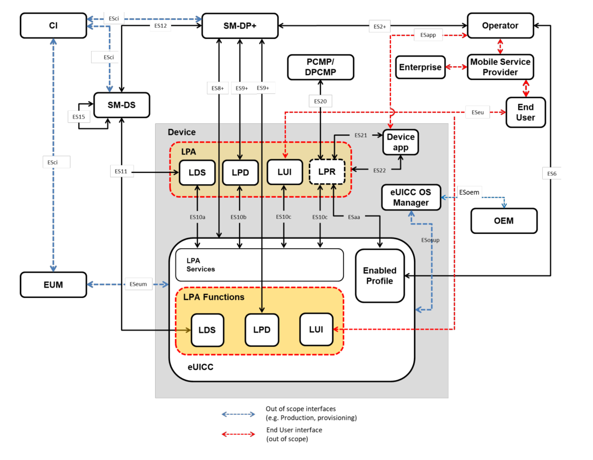

# Remote service provisioning for consumer devices (SM-DP+) implementation

## Table of Contents
- [Introduction](#introduction)
- [Architectural Diagram](#architectural-diagram)
- [Getting Started](#getting-started)
    - [Prerequisites](#prerequisites)
    - [Installation](#installation)
- [Configuration](#configuration)
- [Contributing](#contributing)
- [License](#license)
- [Acknowledgments](#acknowledgments)
- [Roadmap](#roadmap)

## Introduction

Welcome to the dazzling world of GSMA's SGP.21 V3.1 & SGP.22 V3.1 implementation for remote eSIM provisioning using the swanky consumer architecture! This project is not your run-of-the-mill tech endeavor; it's here to serve up a robust and flexible solution for taming those eSIM profiles in consumer devices, all thanks to the Subscription Manager Data Preparation (SM-DP+) protocols.

Whether you're a mobile network operator navigating the digital seas or a device manufacturer steering through the tech wilderness, our implementation is your trusty map to an easy-to-integrate and scalable approach for remote eSIM provisioning. It's like the GPS for your eSIM journey, minus the annoying recalculating route messages.

Now, picture this: I've dabbled in something similar before, a humble attempt that has fueled my curiosity to dive into the updated specs and toss them into the code blender just to see if I've got all the ingredients right. Brace yourself, though – this project is not a walk in the coding park. As a rookie in this arena, I'm gearing up for what promises to be a thrilling coding adventure. But hey, remember, even the tech titans were once coding padawans.

I'm placing my bets on the global tribe of developers joining forces, picking up this project like a hot potato, and collectively sculpting what could arguably become the only open-source version of this futuristic gizmo. So, buckle up and let's code the future together! 🚀

## Architectural Diagram
- Behold the Remote SIM Provisioning System Architecture and the different communication interfaces between different entities.

  

## Getting Started

### Prerequisites

I think we shall be doing this in [Springboot](https://spring.io/projects/spring-boot/) and [PostgresSQL](https://www.postgresql.org/download/) for the backend:

- **Java Spring Boot v3.2.1**: This implementation is built using Java Spring Boot. Visit [here](https://start.spring.io/) to have it setup

- **PostgresSQL**: PostgresSQL is used as the database for backend storage, for now let's keep things SQL.

### Installation

1. Clone the repository:

```bash
git clone https://github.com/oddjobs256/esim-rsp.git
```

```bash
cd esim-rsp
```
```bash
mvn clean install # You can use gradle during spring initialization
```

### Configuration
Customize the implementation according to your needs by modifying the configuration file ```application.properties```. 
Refer to the provided configuration guide for detailed information on available options and their usage.


### Contributing
We welcome contributions from the community! If you find a bug or have an idea for an improvement, please open an issue or submit a pull request.

For more details, please read our contribution guidelines. (We do not have guidelines yet!)

### License

This project is licensed under the MIT License

### Acknowledgments
- Special thanks to the one and only Paul B who introduced me to this arena.
- Inspired by the growing need for seamless eSIM provisioning in consumer devices.
- Built with passion and dedication to improving the digital experience for users worldwide as well as my self.

Feel free to explore, experiment, and contribute to this exciting journey of transforming eSIM provisioning for consumer devices!


### Roadmap
1. [ ] Dive into the documentation, particularly SGP 21 and SGP 22; take the time to grasp their contents. As rookies, keep in mind that additional reference docs will prove valuable as you progress through the implementation journey.
  - [x] SGP 21
  - [ ] SGP 22
1. [ ] Prepare project workspace
2. [ ] Elaborate on next steps once sure
